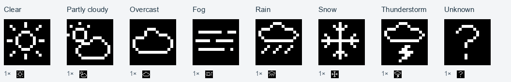
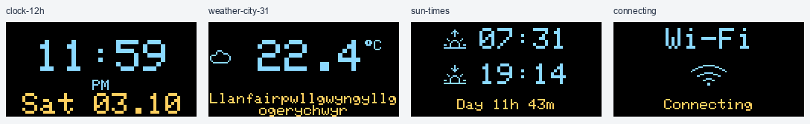

# Reverse Engineering a €5 AliExpress Weather Clock: A Security Story

<p align="center">
  <a href="https://github.com/petrochen/esp8266-weather-clock-opensource/releases">
    
  </a>
  <a href="https://github.com/petrochen/esp8266-weather-clock-opensource/blob/main/LICENSE">
    
  </a>
  <a href="https://github.com/petrochen/esp8266-weather-clock-opensource/issues">
    
  </a>
  
</p>

## TL;DR

I bought a cute weather clock kit from AliExpress ([TJ-56-654](https://pt.aliexpress.com/item/1005008333782531.html)) and discovered it was **leaking my WiFi password in plaintext** to anyone within radio range. So I ripped out the firmware, wrote my own, and ended up with a clock I could inspect, configure and update over WiFi. No weather API key required. No WiFi password on the settings page.

What started as a security fix has become a little **open-source desk clock**:
WiFi time, weather without an API key, readable OLED screens and a compact web
panel. Everything still runs on the original **ESP-01S with 1MB flash**.

[](https://github.com/petrochen/esp8266-weather-clock-opensource/blob/d0160e765f243cfb2441c639ccc5eb89cc4e54cd/docs/OLED_PREVIEWS.md)

*The 1.11 beta, rendered by the actual firmware with sample data. Extra screens
are opt-in. [Still image](images/clock-demo-poster.png).*

### Choose your firmware

| | Version | What you get |
| --- | --- | --- |
| **Stable** | [1.10.0](https://github.com/petrochen/esp8266-weather-clock-opensource/releases/tag/v1.10.0) | Time, weather, sunrise/sunset, night schedule, compact web settings and PIN-protected file uploads |
| **Beta / testing** | [1.11.0-beta.4](https://github.com/petrochen/esp8266-weather-clock-opensource/releases/tag/v1.11.0-beta.4) | Daytime UV, more weather screens, Home Assistant cards, screen presets and GitHub version selection with rollback warnings |

The **1.11 beta** adds today's UV peak and tomorrow's maximum, feels-like
temperature and outdoor humidity, hourly rain probability, two-day highs/lows,
wind direction and a combined time-and-weather screen. Choose the pages you want,
set their timing, or send a short-lived card from Home Assistant.

**New in beta.4:** choose a specific Stable or Beta version in the web panel,
reinstall or roll back with your six-digit PIN, and see which features will be
lost before installing. The browser downloads and checks the image; the clock
confirms its version after restarting. A real **beta.2 → beta.4 → beta.3 → beta.4**
trial retained all 30 compared settings. Power-loss recovery and longer hardware
runs still need testing. [Release notes](https://github.com/petrochen/esp8266-weather-clock-opensource/releases/tag/v1.11.0-beta.4)
· [Update and rollback guide](https://github.com/petrochen/esp8266-weather-clock-opensource/blob/d0160e765f243cfb2441c639ccc5eb89cc4e54cd/docs/UPDATES.md)
· [Home Assistant](https://github.com/petrochen/esp8266-weather-clock-opensource/blob/d0160e765f243cfb2441c639ccc5eb89cc4e54cd/docs/HOME_ASSISTANT.md).

**First installation?** Start with the [flashing guide](docs/INSTALLATION.md).
The default branch (`main`) builds **Stable 1.10.0**; to build the beta, check out
its release tag. A normal update needs only the firmware `.bin`, not a filesystem
image. For release notifications, choose **Watch → Custom → Releases**.

**Here for the story?** Read on.

- [Choose your firmware](#choose-your-firmware)
- [The discovery](#the-discovery-when-smart-means-insecure)
- [The investigation](#the-investigation)
- [The solution](#the-solution-custom-firmware)
- [Try it on your clock](#try-it-on-your-clock)
- [Security, without the marketing](#security-without-the-marketing)
- [Documentation & contributing](#documentation--contributing)

## The Discovery: When "Smart" Means "Insecure"

It started innocently enough. I ordered what looked like a fun DIY electronics project: an ESP8266-based weather clock with a transparent acrylic case and an OLED display. The listing promised WiFi weather updates, a three-day forecast, temperature, humidity and date/time. All for about €5.

What it didn't mention was the setup page.

You connected to the device's access point, entered your home WiFi credentials, and the clock joined your network. Fair enough. Except **the setup AP stayed active in parallel, and the configuration page displayed the WiFi password in plaintext**.

Anyone nearby who could join that AP using its default password could open `192.168.4.1`, read the credentials and join the home network. This is a textbook example of poor IoT security design. No thanks.

The original firmware also depended on a QWeather account and API key, offered little customization, and had no OTA update path I could use. Closed-source firmware made it hard to find out what else was going on.

## The Investigation

The transparent case made inspection easy — just unscrew the brass standoffs. Inside was a socketed ESP-01S, a four-wire OLED display and no local temperature or humidity sensor. Those readings came from the weather service.

| Part | What I found |
| --- | --- |
| Board | TJ-56-654 |
| MCU | ESP-01S / ESP8266EX, 1MB flash |
| Display | GM009605v4.3, 128×64 I²C OLED; SSD1306 driver |
| Power | 5V Micro-USB to the board; **3.3V at the ESP-01S** |
| Case | Transparent acrylic, about 40×40×43mm |

A 3.3V USB-to-serial adapter and a few jumper wires were enough for the first flash. The ESP-01S comes out of its socket, so there is no need to solder programming wires to the board. After that, updates can happen over WiFi. The [flashing guide](docs/INSTALLATION.md#hardware-connection) has the wiring and boot-mode steps.

One hardware quirk cost more time than it should have: **the I²C pins aren't the ones most ESP8266 examples use**.

```cpp
Wire.begin(0, 2);  // SDA=GPIO0, SCL=GPIO2 on this board
```

The display is normally at `0x3C`; the firmware also tries `0x3D`. If you're porting this to another board, start with the [hardware notes](docs/HARDWARE.md).

## The Solution: Custom Firmware

I decided to write a replacement I could understand and keep improving. The goal was still a small clock on a desk — not another cloud account to maintain.

| Feature | What it does |
| --- | --- |
| 🌐 Time & connection | WiFi setup portal, asynchronous NTP/DNS, reconnect backoff, configurable timezone and European DST rules |
| 🌦️ Weather | Open-Meteo temperature, condition icons, wind and calculated sunrise/sunset; no API key |
| 📺 Display | Rotating time, weather and sun screens; brightness, orientation and an optional night schedule |
| 🔄 Updates | Browser upload with a six-digit PIN; ArduinoOTA remains available |
| 🖥️ Web interface | Compact English desktop/mobile panel with grouped settings, Save/Discard, PIN updates and on-demand diagnostics |
| 🔌 Integrations | Local JSON API for time, weather, settings and device status |

Weather failures keep the last good reading, marked as stale. Time and weather requests recover through bounded retries. The clock can show an unsynchronized-time placeholder instead of pretending an epoch is the current time.

The web page is compressed in flash, with no framework, external font or separate filesystem image. Seconds tick in the browser; the visible dashboard requests fresh data once a minute. The network state machines are asynchronous, but startup provisioning, HTTP serving, OLED transfers and firmware updates still have synchronous work. It's a small ESP8266, not a promise of zero blocking.

### What's new in 1.10.0?

The stable release brings **PIN-only updates**, a redesigned web interface, optional night mode, saved orientation before the startup screen, and small weather icons with corrected condition mapping. It also fixes weather/DNS recovery, empty uploads and the zero-brightness regression from an intermediate development build.

The PIN appears on the physical display only when requested. There is no PIN screen or extra waiting period at startup. Night mode is off by default; showing a PIN temporarily wakes the display.

I redrew the weather icons pixel by pixel. At **16×16**, a filled cloud looked more like a blob, so it now has a hollow outline; rain, snow and lightning have distinct shapes. All eight icons together use **256 bytes in flash**.

[](images/weather-icons.png)

*Enlarged without smoothing, with native-size samples underneath. Click for the before/after comparison and full OLED layouts.*

Rendering every screen uncovered a few less obvious problems: a long city lost
both ends, `No Data` dropped its last letter onto another line, and a quarter-turn
made text collide. The refreshed **v1.10.0** fits the actual display dimensions,
reads names such as `Portimão` and `Санкт-Петербург`, and adds AM/PM. Wi-Fi now has
moving waves with a `Connecting` label; sunrise and sunset have little suns above
the horizon. The full [screen gallery](docs/OLED_PREVIEWS.md) includes all 51
scenarios in four orientations, before and after.

[](docs/OLED_PREVIEWS.md)

Four improvements were adapted from Stibax's fork, while retaining this project's newer network and settings code. See the [backport notes](docs/BACKPORTS.md), [release notes](docs/releases/v1.10.0.md) and [full changelog](CHANGELOG.md).

## Try It on Your Clock

**First installation:** use a **3.3V** USB-to-serial adapter and the [installation guide](docs/INSTALLATION.md). The build target is Generic ESP8266, **1MB / 64KB filesystem, DIO, 80MHz**. The ESP-01S itself is not 5V tolerant.

After flashing, connect to **TJ56654-Setup** with the setup password `12345678`, then open `http://192.168.4.1` and choose your 2.4GHz WiFi network. Once connected, use the address shown by your router or `http://tj56654-clock.local/` where mDNS is available.


*From connecting to the clock. Sample network details; timing is edited for
readability, not a startup benchmark. The final combined screen is a beta feature.
[Still image](images/wifi-demo-poster.png).*

**Already running this firmware?** Open `/update`, choose the clock's `.bin`, press **Show PIN on clock**, enter the six digits, then choose **Upload & restart**. The current installed version handles that first upload, so an older version can still require its existing login/code. The new page appears after the update.

**Already on beta.2 or beta.3?** Choose **Stable + Beta → Check GitHub** to
install beta.4 with your PIN, without downloading a file yourself. Reload the
page after the restart to get the new **All / Stable / Beta** version picker.
Going back to beta.1 or 1.10.0 removes GitHub updating; you will need a manual BIN
upload to return. See the [compatibility guide](https://github.com/petrochen/esp8266-weather-clock-opensource/blob/d0160e765f243cfb2441c639ccc5eb89cc4e54cd/docs/UPDATES.md).

The normal update needs **one firmware file**. The web interface is inside it; leave the advanced Filesystem option alone unless you have a separate filesystem image for a specific reason.

Settings live at `/config`. Display, location, intervals and night mode apply when saved; changes to WiFi credentials, hostname or NTP server restart the clock. See the [user guide](docs/USAGE.md) for schedules, PINs, recovery and settings backup.

## Security, Without the Marketing

The original leak was the reason for this project, so the distinction matters:

- **WiFi passwords stay out of the settings page, JSON export and application logs.** A blank password field keeps the saved password.
- **Updates, restart and full reset need the device's PIN.** It is random, stored across restarts and updates, and shown only on the OLED when requested.
- **Ordinary settings and read-only APIs are open on the local network.** That's intentional for these home clocks.
- **This is local HTTP, not HTTPS.** The setup/recovery AP has a shared default password, and secrets are stored on the device without encryption. Keep these interfaces on a trusted network; the PIN is not Internet-facing authentication.

Normal operation uses station mode. Setup or connection failure can enable an AP; the 180-second WiFiManager portal timeout is not a timeout for every fallback AP. Details and recovery paths are in the [installation guide](docs/INSTALLATION.md#recovery-and-reset).

## Documentation & Contributing

The README tells the story. These pages hold the instructions and reference material:

| If you want to… | Read |
| --- | --- |
| Install, update or recover a clock | [Installation](docs/INSTALLATION.md) |
| Use the web pages, night schedule and PIN | [User guide](docs/USAGE.md) |
| Connect scripts or a home automation system | [API reference](docs/API.md) |
| Check wiring and memory layout | [Hardware](docs/HARDWARE.md) |
| Understand timers, state machines and storage | [Architecture](docs/ARCHITECTURE.md) |
| Build, test or prepare a release | [Contributing](CONTRIBUTING.md) and [validation](docs/VALIDATION.md) |
| See changes and their sources | [Changelog](CHANGELOG.md) and [fork backports](docs/BACKPORTS.md) |

Bug reports, tested fixes and small improvements are welcome. Start with [CONTRIBUTING.md](CONTRIBUTING.md). Please distinguish a successful build from a successful test on the clock — both matter, and the [validation notes](docs/VALIDATION.md) record what has actually been checked.

## Credits

**Hardware:** TJ-56-654 Weather Clock Kit. **Firmware:** written from scratch with love and frustration.

Built with [ESP8266 Arduino Core](https://github.com/esp8266/Arduino), [Adafruit GFX](https://github.com/adafruit/Adafruit-GFX-Library), [Adafruit SSD1306](https://github.com/adafruit/Adafruit_SSD1306), [WiFiManager](https://github.com/tzapu/WiFiManager), [ArduinoJson](https://github.com/bblanchon/ArduinoJson), [ESPAsyncTCP](https://github.com/me-no-dev/ESPAsyncTCP) and [AsyncHTTPRequest_Generic](https://github.com/khoih-prog/AsyncHTTPRequest_Generic). Weather comes from [Open-Meteo](https://open-meteo.com/).

Thanks to the people reporting bugs and sharing fixes in forks, especially Stibax for the [adapted improvements](docs/BACKPORTS.md). Tools of the trade: Arduino IDE, a USB-to-serial adapter, and lots of coffee ☕.

## License

[MIT](LICENSE). Do something useful with it, keep the license notice, and consider sharing your improvements — that's how we make IoT better.

**Author:** apetrochenko
