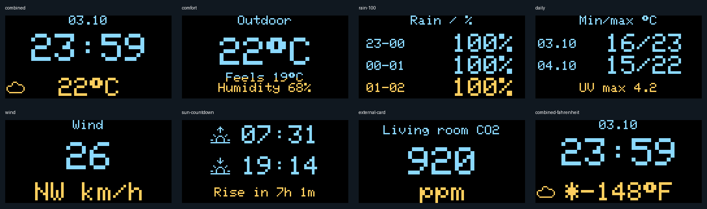
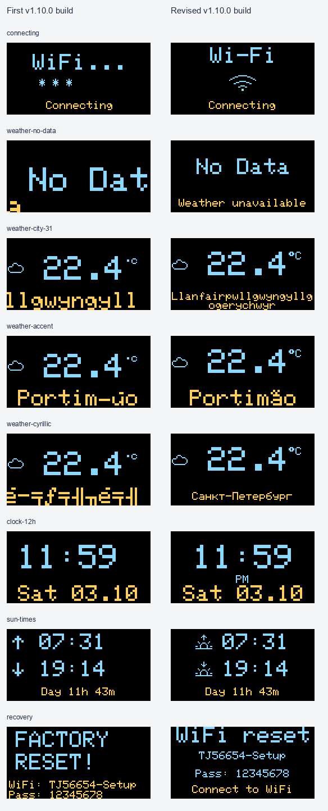
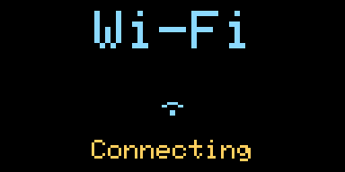
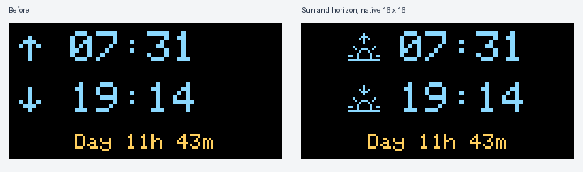
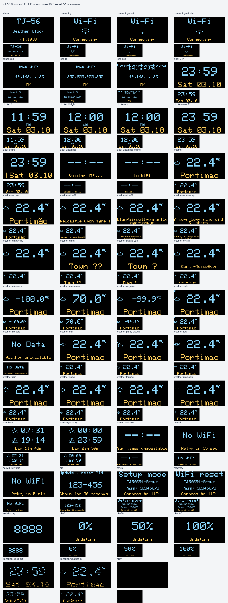
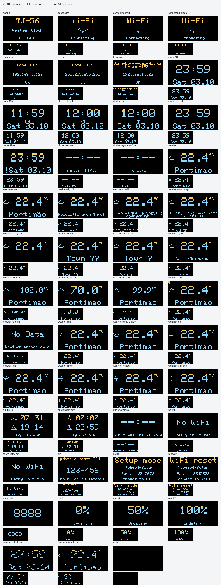
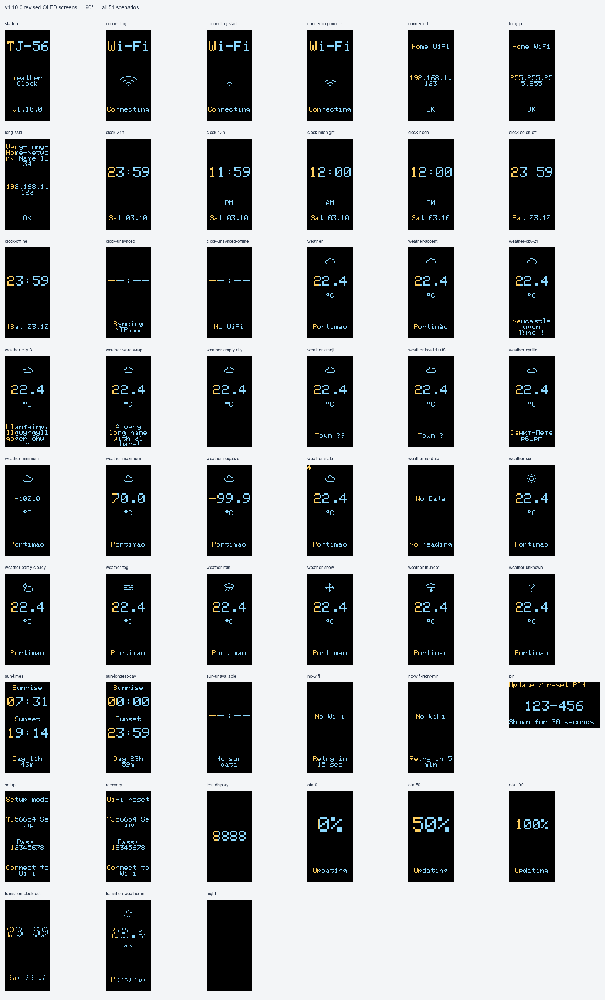
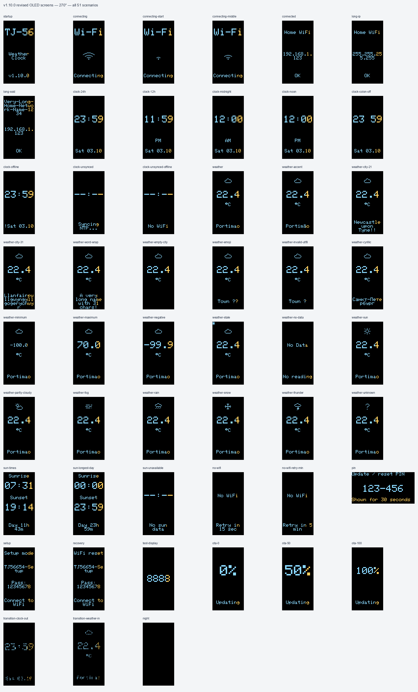

# Every OLED screen, before and after

## README animations

The [screen tour](../images/clock-demo.gif) holds each of nine pages for 2.4–3.8
seconds. The [Wi-Fi demo](../images/wifi-demo.gif) cycles the three real connection
frames, shows the connected screen, then the clock. They are composed from the
same verified native PNGs as the gallery below, enlarged exactly 4× without
smoothing. Only the frame and explanatory captions are added outside the OLED.
These are synthetic demonstrations, not a recording or startup timing measurement.
The gallery uses direct page changes; the firmware also supports dissolve.

Both GIFs loop and total about 220 KB. For a still view, use the
[screen poster](../images/clock-demo-poster.png),
[Wi-Fi poster](../images/wifi-demo-poster.png) or the full static gallery.
They are documentation assets and are not embedded in the firmware.

To regenerate after updating the actual screen renders:

```sh
python3 tests/render_display.py --arduinojson /path/to/ArduinoJson/src \
  --gfx /path/to/Adafruit_GFX_Library --output build/display-preview --sanitize
python3 -m pip install Pillow==12.2.0
python3 tools/make_readme_gifs.py --renders build/display-preview
```

The generator checks input clipping metrics, then decodes every GIF frame to
verify exact OLED pixels, duration and loop metadata. It uses Pillow's bundled
font for the surrounding captions, a fixed palette and no image-generation model.

## 1.11 beta gallery

The prepared beta adds 29 scenarios for combined time/weather, outdoor comfort,
rain, daily min/max/UV, wind units/direction, moon, sun countdown, external cards
and dimming, including eight UV scenarios (all levels, absent/stale data). Together with the 51 existing
cases, **80 scenarios × 4 orientations = 320 actual GFX renders** are checked.
The beta package contains `OLED_GALLERY.html` and a ZIP with native PNGs, metrics
and an offline index. These show the final beta state; the historical 1.10
before/after gallery below remains unchanged.

[](../images/beta-oled-preview.png)

Pixel layouts are checked with the production drawing code and pinned GFX font.
They do not substitute for physical checks of OLED brightness, color bands or I²C.


The refreshed **v1.10.0** keeps the original release number and replaces its first
build, `5ae2387ac626`. These are pixels drawn by the firmware with the actual
Adafruit_GFX 1.12.4 rasterizer and font, using synthetic data. There are **51
scenarios in four orientations: 204 new renders and 204 corresponding old ones**.

Download the [self-contained interactive gallery](https://github.com/petrochen/esp8266-weather-clock-opensource/releases/download/v1.10.0/OLED_GALLERY.html)
and open it in a browser. It includes every before/after image, notes, search,
orientation and zoom controls. The [complete PNG archive](https://github.com/petrochen/esp8266-weather-clock-opensource/releases/download/v1.10.0/weather-clock-v1.10.0-oled-renders.zip)
also contains the gallery, metrics and provenance. No internet connection is
needed after downloading. All PNGs preserve the native pixel grid.

## What changed

| Screen | Change |
| --- | --- |
| Time | Centered digits and AM/PM; stable spacing when the colon blinks |
| Weather | Long labels fit, UTF-8 names render correctly, `No Data` stays together, °C uses the right glyph |
| Sunrise / sunset | Native 16×16 hollow sun and horizon, with small up/down cues; portrait uses explicit labels |
| Wi-Fi connection | Native 24×16 wave animation and `Connecting`, replacing dots/stars; no new startup delay |
| Connected / retry | SSID, IP and status occupy separate bounded regions |
| Setup / recovery | Network and password fit; `WiFi reset` accurately names the physical recovery action |
| Display test / ArduinoOTA | Centered numbers; ArduinoOTA has a percent unit and `Updating` label |
| PIN / night / transitions | Existing behavior retained and rendered; PIN temporarily uses landscape |



### Connection and sun symbols



The existing connection attempts advance the frames. The animation represents
connection activity, not measured signal strength. Its bitmaps take 144 bytes in
flash. The two sun/horizon symbols take another 64 bytes; neither needs scaling
or an extra framebuffer.



### Long names

The EEPROM field remains **31 UTF-8 bytes**, including spaces. A 55-character name
is rejected when saving. `Санкт-Петербург` is 15 glyphs but 29 bytes. The settings
page shows the byte count. Short names keep the large font; longer ones use one
or two small-font rows, or up to four in portrait. Word breaks do not discard the
remaining text. Coordinates, not the label, determine the weather.

ASCII, Russian letters including Ё/ё, and common Latin-1 accents are supported.
Some less common accents use their base letter; other scripts/emoji show `?`.
Original UTF-8 stays intact in settings and in the browser.

## All 51 scenarios at each orientation

These sheets show the revised build. The downloadable gallery includes the old
frame beside every new one. The yellow band is part of the physical panel, so it
moves to the top or side when rotated; it is not a software color choice.

<details open>
<summary>180° — normal mounting</summary>



</details>

<details>
<summary>0°</summary>



</details>

<details>
<summary>90° — portrait</summary>



</details>

<details>
<summary>270° — portrait</summary>



</details>

## Verification and limits

All 204 new renders pass checks for automatic wrapping, off-screen character
cells and clipped drawing, with address/undefined-behavior sanitizers. Tests also
exercise every accepted ASCII city length and every single-space position, UTF-8,
temperature limits, 12-hour boundaries, stale/missing data, night blanking and
dissolve frames. Generate the current set with `tests/render_display.py`; see
[build and validation](VALIDATION.md).

The old frames intentionally retain the old defects. Cell-boundary metrics alone
do not imply that visible ink is clipped. These images do not simulate OLED glow,
brightness, I²C timing, Wi-Fi or actual firmware uploads. The refreshed build
still needs physical OLED and device validation.
