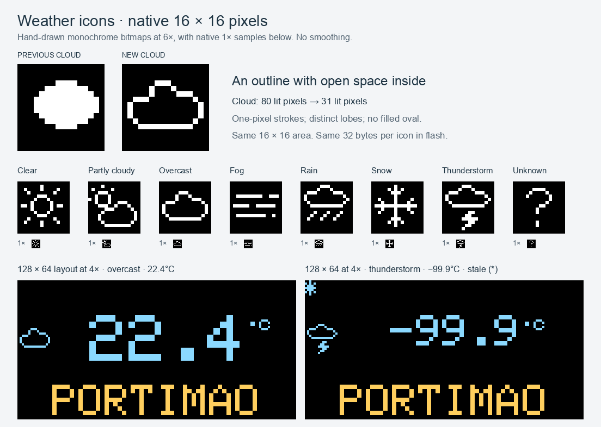

# v1.10.0 — PIN updates, compact UI & clearer OLED icons

**2026-10-03**. Changes below are relative to the
previous public release, **v1.9.10**, and include the intervening local development
builds. Hardware validation limits are listed below.

This update makes everyday use simpler: one firmware file, a six-digit PIN, and
clearer pages for the clock and its settings. It also repairs time/weather recovery
and adds an optional schedule for turning the OLED off at night.

## What's new

- **PIN-only web updates.** Press **Show PIN on clock**, read the six digits on the
  OLED, and confirm the upload. No username field. The PIN is shown only on request,
  never during startup, and stays the same across restarts and updates.
- **A compact English web interface.** Clock, Settings and Update pages work on desktop
  and mobile. All 22 settings controls and Save fit at 1280×800 and 1366×768, with
  aligned labels, visible NTP fields, unsaved-change status and a Discard action.
  Device vitals are visible below the clock. The update page uses one file selector, checks for empty files and an
  incorrect PIN before upload, and reports progress and firmware validation errors.
- **Optional night mode.** Set a local-time window, including one across midnight.
  The OLED sleeps while network work continues. Showing a PIN or testing the display
  temporarily wakes it. Night mode is disabled by default after upgrading.
- **Display improvements.** Saved orientation applies before the startup screen.
  Eight hand-drawn 16×16 weather icons use hollow clouds, distinct rain/snow/bolt
  shapes and a separate partly-cloudy symbol. They render at native resolution
  and occupy 256 bytes in flash. Brightness zero remains dim and visible.
- **Downloadable CI builds.** Successful checked builds produce a firmware file
  named with version and commit, plus SHA-256 and target information.

*These previews are decoded from the firmware's actual bitmap bytes. The cloud
uses 31 lit pixels instead of 80; a hollow outline keeps its shape distinct. The
whole set takes 256 bytes in flash, just 32 bytes more than the previous set, with
no extra framebuffer or runtime scaling. Physical OLED testing remains pending.*

## Reliability and resource use

- Weather refreshes recover after connection, HTTP and JSON errors, with a watchdog
  for stalled transport. A failed refresh preserves the last good reading and marks
  it stale instead of silently presenting it as current.
- NTP uses a single asynchronous DNS/UDP path, recovers from startup DNS failures,
  rejects late responses and keeps UTC epoch separate from local display time.
- Form and JSON settings updates share validation. WiFi passwords are omitted from
  exports and pages; an empty password field preserves the saved one.
- The self-contained web page is compressed in flash. The browser advances seconds
  locally and polls status once a minute only while the dashboard is visible.
- Static OLED screens avoid unnecessary redraws. Same-screen transitions and
  blocking connection/test overlays have been removed.

The pinned ESP-01S build must pass binary, static-RAM and instruction-memory budgets.
Exact measurements and the comparison with v1.9.10 are in
[Build validation](../VALIDATION.md#local-validation-on-2026-10-03).

## Updating an existing clock

1. Download the **firmware `.bin`** for this release and its `SHA256SUMS`. Verify the
   checksum if available. The target is ESP-01S with **1MB / 64KB filesystem, DIO,
   80MHz**.
2. Open your clock's `/update` page. The currently installed firmware handles this
   upload: use its existing login or maintenance code. The PIN-only page appears
   after installing 1.10.0.
3. Upload the firmware and keep power connected until the result is known. No
   separate filesystem image is required; the web interface is part of the firmware.
4. After the restart, reopen the page and check **v1.10.0** in the header. Use
   **Show PIN on clock** to read the PIN for future updates.

Saved WiFi and ordinary settings keep their existing layout. The night schedule
uses a separate record and starts disabled. Devices running local 1.9.11/1.9.12
builds use their old long code for this upload, then generate a six-digit PIN once.
An existing six-digit PIN from 1.9.13-dev or 1.10.0-dev is retained.

Web PINs may be entered with or without the dash; ArduinoOTA uses six digits only.
Normal settings remain open on the trusted local network. Restart keeps settings
and PIN; **Reset all settings** clears both. Physical three-power-cycle recovery
clears WiFi only. Legacy `admin` Basic-auth scripts remain compatible.

For a clock made dark by the intermediate 1.9.11-dev build, set brightness to **4**
through its settings page to restore the screen before updating.

## Integrations and development

The existing API routes remain available. `/api/status` adds weather, display and
clock fields so the dashboard needs one request. Local time text now follows the
configured timezone; `/api/time.epoch` remains UTC. Check `synced`/`ntp_synced` before
using time, and weather `stale`/`age_seconds` before treating a reading as current.

Empty upload requests now fail with HTTP 400. Protected actions require the PIN;
HTTP-200 upload responses containing `Update error:` are failures. See the updated
[API reference](../API.md) for response fields and maintenance headers.

NTPClient is no longer a dependency. Builds use pinned core/library versions and a
generated web header; see [Contributing](../../CONTRIBUTING.md). README keeps the
original reverse-engineering story, with setup, usage and API details moved into
dedicated guides.

## Verification status

Local host regressions and Chromium tests against a simulated clock API pass. The
firmware is built with the pinned toolchain and checked against memory budgets.
Desktop/mobile layouts, missing/empty uploads, incorrect PINs, core validation
errors, settings round-trips and hidden-tab polling are covered.

The 1.10.0 image has **not yet been verified on the target clock**.
Real PIN-authenticated OTA/restart, night-mode timing and wake-up, physical icon
rendering, runtime heap under the combined status response, and a 24–72-hour soak
remain to be checked. Automated test and build results are recorded in
[validation notes](../VALIDATION.md); they do not establish these hardware results.

For notifications about future releases, select **Watch → Custom → Releases** on
the repository page. Feedback and hardware test reports are welcome in the linked
release discussion.

Thanks to **Stibax** for the four adapted fork improvements, and to everyone
reporting problems and sharing fixes. [Backport sources](../BACKPORTS.md) and the
[full changelog](../../CHANGELOG.md) record the details.
