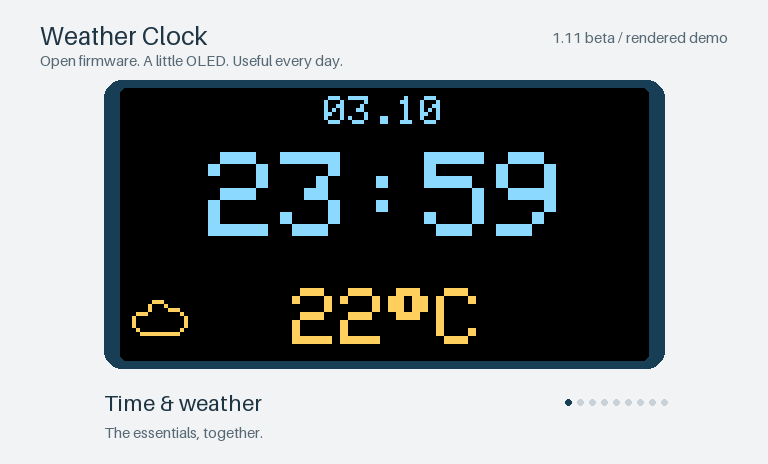
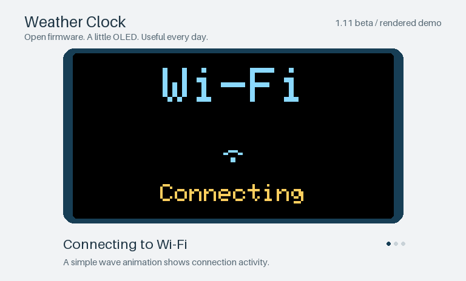
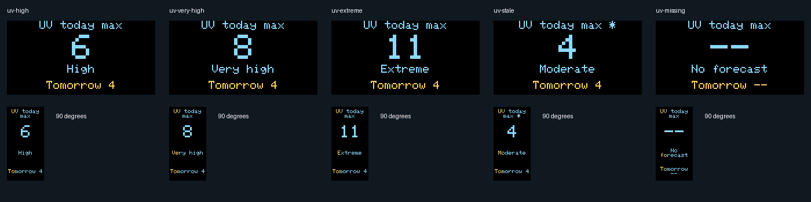
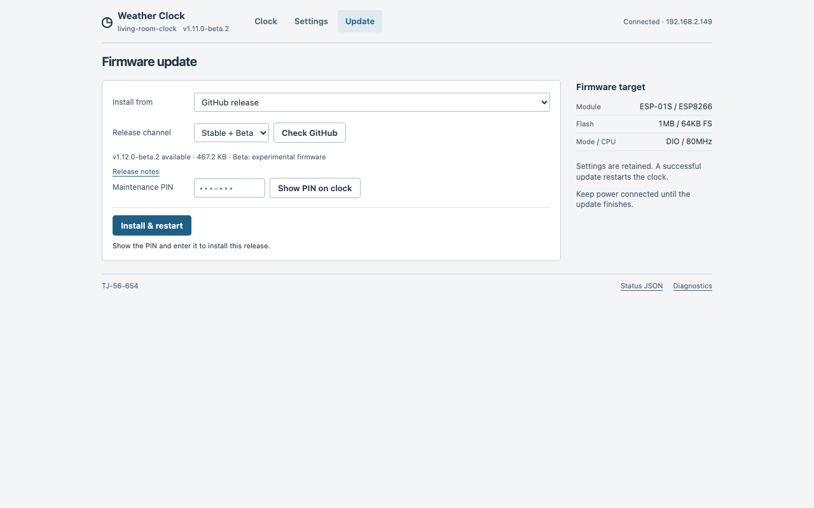
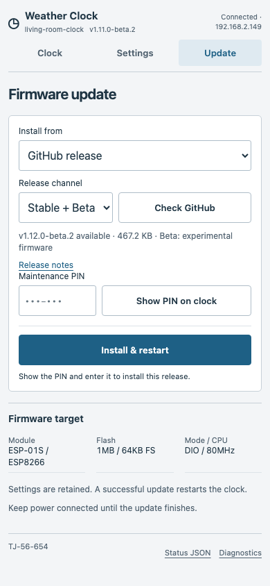
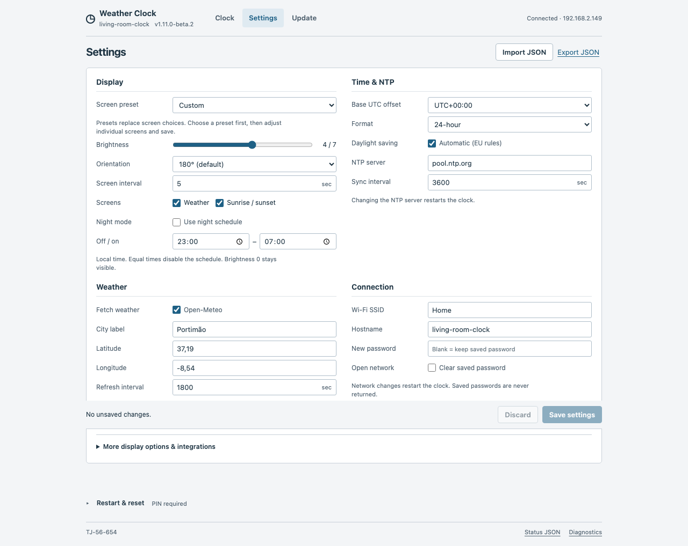

# v1.11.0-beta.2 — GitHub updates & verified settings

Install updates from GitHub with your clock's PIN, verify saved settings, and
keep more room for future firmware changes. **Pre-release for ESP-01S.**

## Added

- **GitHub updates:** check Stable or Stable + Beta and install from the Update
  page without manually downloading a file. Your browser checks the target,
  image size and SHA-256; the PIN is sent only to your clock.
- Verified stable/beta catalogs and firmware downloads hosted in this repository.
- Pinned code linters and memory/undefined-behavior sanitizers for all seven
  host test programs.

## Changed

- Clearer screen presets: **Combined clock + UV**, **Custom** after individual
  changes, and explanations for unavailable Clock-page options.
- A compact firmware-upload handler, retaining the ESP8266 core writer and
  manual file uploads. Settings and the maintenance PIN remain compatible.
- Shared JSON parsing and less repeated weather/sun formatting: **2,176 bytes
  less firmware and 368 bytes less static RAM** than the preceding local beta.2
  build, with unchanged memory budgets.
- Three release downloads: the firmware, `SHA256SUMS` and `BUILD_INFO.txt`.
  Documentation and previews are linked below; GitHub also provides source archives.

## Fixed

- **Saved means verified:** non-restarting settings saves are read back before
  confirmation. If verification fails or values differ, edits remain for retry.
- Interrupted or multiple-file uploads cannot finalize a firmware update;
  finalization waits for the complete authenticated request.

All beta.1 features are included: daytime UV for today/tomorrow, comfort, rain,
wind, daily forecasts, screen presets, night dimming and the external Home Assistant card.

## Install

1. Download [weather_clock-v1.11.0-beta.2-a1fc0659716f.bin](https://github.com/petrochen/esp8266-weather-clock-opensource/releases/download/v1.11.0-beta.2/weather_clock-v1.11.0-beta.2-a1fc0659716f.bin).
2. Open your clock's `/update` page, select the file under **Firmware**, and
   confirm with the six-digit PIN shown on the clock.
3. Leave **FileSystem** empty. The web interface is included in the firmware.

The first update from beta.1 or older uses its existing file-upload page; an
older version may still ask for its existing login/code. After installing beta.2,
GitHub updates are available in the new Update page. Keep the browser tab open
during installation. Updates require confirmation; there is no unattended schedule.

## Validation and limitations

- ESP-01S: **1 MB / 64 KB filesystem, DIO, 80 MHz CPU**.
- Firmware: **476,496 bytes**; static RAM: **38,464 bytes**;
  instruction region including cache: **62,007 / 65,536**.
- [GitHub checks passed](https://github.com/petrochen/esp8266-weather-clock-opensource/actions/runs/37130656621)
  for firmware commit `a1fc0659716f`: build, lint, host/browser tests, setup portal,
  update validation and **320 OLED renders without wrapping or clipping**.
- **Physical OTA, reboot/recovery and long-running hardware validation remain
  pending.** This pre-release does not add automatic rollback.

## Previews

Wi-Fi demo, UV and web-interface screenshots

Previews use synthetic data. The update screenshots show an example future
release, not the currently published catalog. [Download the complete 320-screen
gallery](../previews/v1.11.0-beta.2-oled.html?raw=1) and open it in a browser.

[Full changelog](../../CHANGELOG.md#1110-beta2---2026-10-03-pre-release) ·
[Update guide](../UPDATES.md) · [Optimization audit](../CODE_QUALITY.md) ·
[OLED preview guide](../OLED_PREVIEWS.md)
