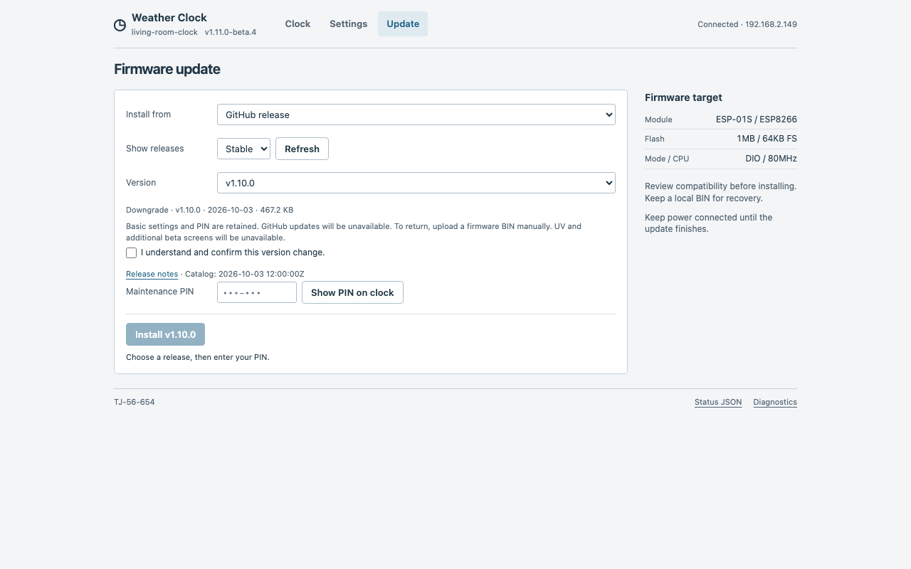

# 1.11.0-beta.4 — choose your firmware

Pre-release for testing version selection and rollback. Stable remains 1.10.0.

## Added

- Compact **All / Stable / Beta** filter and explicit version picker. See which
  build is installed/recommended and update, reinstall or downgrade with a PIN.
- Consequences beside the selected version: whether GitHub updating survives,
  which beta screens disappear and how to return using a local BIN. Unknown
  storage formats and withdrawn builds cannot be installed from the catalog.
- Separate release history with audited settings/capability profiles. Older
  beta.2/3 clients retain their existing small catalog and update path.

## Changed

- Refresh requests a fresh catalog URL and shows the catalog publication time.
- Release downloads remain **BIN, SHA256SUMS, BUILD_INFO.txt**. The web page is
  included in the firmware; no filesystem upload is necessary.

## Fixed

- Installing an older Stable release or reinstalling the current version is
  now possible. Downgrades/reinstalls need an explicit checkbox confirmation.
- Upload success no longer means installation complete. The page waits for a
  restart and checks the reported version; uncertain results require checking
  the clock before another attempt. Local files have no known target version.

## Install and rollback

From beta.2/3, select **Stable + Beta → Check GitHub**, show the PIN and install
beta.4. After restart, reload `/update` to
load the new version picker. Older firmware needs a manual BIN upload.

Going back to beta.1 or 1.10.0 removes GitHub updating: keep a local BIN to return.
1.10.0 also lacks UV and the additional beta screens. Core settings, PIN and night
settings share the audited storage format; a normal save preserves the separate
beta record. Resetting all settings can erase it. See the [transition details](../UPDATES.md).

## Validation

The local pinned build passed: **477,664 bytes**, **38,464 bytes static RAM**,
**62,007 / 65,536 instruction bytes including cache**. OTA headroom is **1,568 bytes**.
Host suites with sanitizers, publisher/version tests, the embedded browser suite,
linters and asset reproducibility passed. Real historical release images and
legacy beta.2/3 catalog readers were verified. See [validation details](../VALIDATION.md#1110-beta4-local-validation).

*Actual embedded UI with a simulated clock/catalog, illustrating rollback warnings;
this is not evidence of a physical installation.*

## Physical update and rollback trial

On 2026-10-03, a physical ESP-01S completed **beta.2 → beta.4 → beta.3 → beta.4**
using the clock's actual GitHub/PIN web interface, without manual BIN uploads.
The beta.4 page displayed the rollback consequences and confirmed beta.3 after
restart; beta.3 then offered beta.4 through the preserved legacy catalog. All
**30 compared display, screen, unit and night settings** matched after each step.
The same maintenance PIN worked throughout. The clock was left on beta.4.

This checks one device and this specific route. Older Stable rollback, power-loss
recovery and long-running hardware testing remain unverified. Live GitHub CDN
caching briefly delayed discovery immediately after publication; the normal
Check GitHub button eventually found beta.4 without a workaround.

There is no unattended update or dual-bank automatic rollback.
